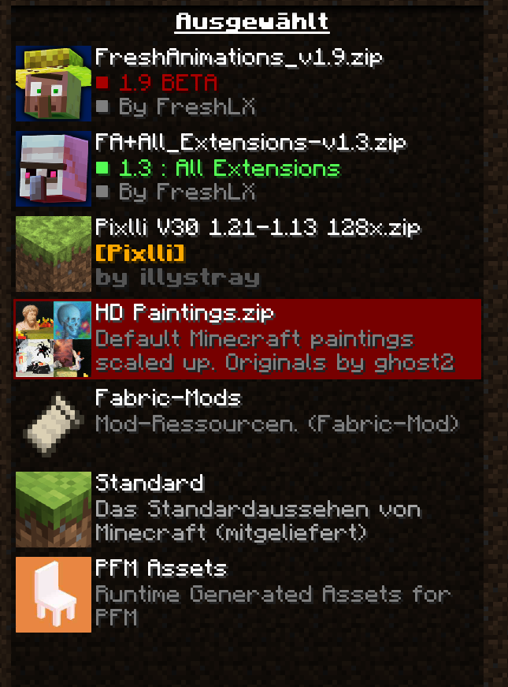
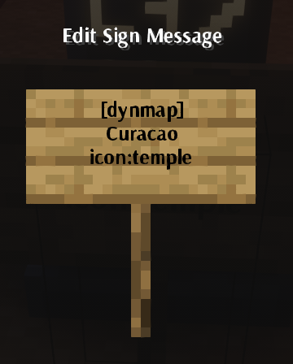
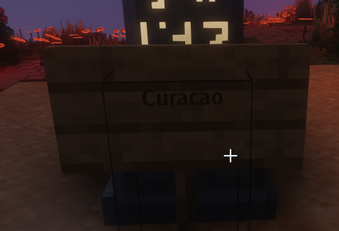
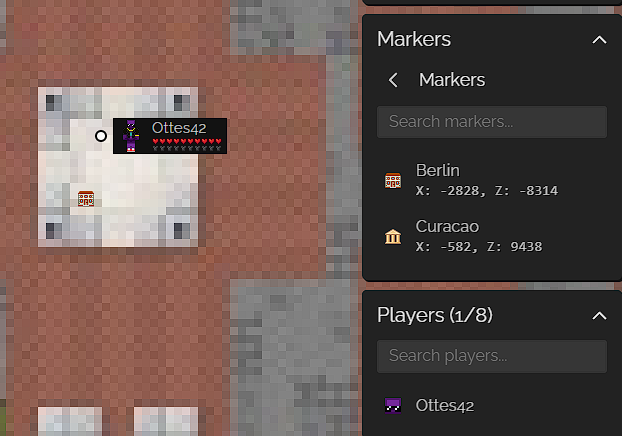

# Schachtspß Hilfe

Zu finden unter https://help.mine.ottes.club

## ModPaket

Seit 1.4 haben wir folgendes geändert. Im 1.5 wird das dann so enthalten sein, derzeit am besten 1.4 installieren und dann die Liste durchgehen.

- dynamic-lights gelöscht (nur auf Server oder mit SinglePlayer Welt nötig)
- coven resourcen gelöscht
- Lithium auf Server und Client (freiwillig)
- WorldEdit CUI Client (freiwillig)
- DynamicFPS im Client (freiwillig)

### Mod hinzufügen oder updaten

Aufs Puzzleteil, dann suchen, dann installieren.

Für update in der Liste auf den Pfeil-Runter, nur wenn es gemacht werden soll.

## Downlad

Es gibt derzeit drei Versionen des ModPakets

- [FamilienFabric-1.4.zip](./assets/FamilienFabric-1.4.zip) - volles Paket, 60MB Download und großes Resourcenpaket, nichts für eine schwache Leitung (ca 60MB mit JourneyMap)
- [FamilienFabric-ohnemapinhalt-1.4.zip](./assets/FamilienFabric-ohnemapinhalt-1.4.zip) - gleiches Paket, aber ohne (teil-)aufgedeckte Map, damit kleine zip-Datei, aber immer noch große Resourcen
- [FamilienFabric-ohnecoven-1.4.zip](./assets/FamilienFabric-ohnecoven-1.4.zip) - keine Map, kein [Coven](https://www.curseforge.com/minecraft/texture-packs/coven), auch mit DSL Lite machbar

## Update 1.5

Die Zip Datei enthält alle neuen jars, doppelte (mit alten Versionen) bitte löschen.

[FamilienFabric-1.5-patch.zip](./assets/FamilienFabric-1.5-patch.zip.zip)

### Changelog

Neue Mods

- Laser Bridges & Doors (Laser-Brücken und -Tore)
- Omni-Hopper (Trichter, die in alle Richungen gehen, nicht nur oben offen)
- Friends&Foes (viele neue Tiere)
- Friends&Foes - Flowery Mooblooms (neue Kühe)
- Friends&Foes - Beekeeper Hut (Imker-Hütte als Struktur)
- Repurposed Structures - Friends and Foes Compat Mod (mehr Strukturen in neuen Chunks beim Erkunden)
- Repurposed Structures (noch mehr Strukturen)
- Hybrid Aquatic (viele neue Unterwasser-Tiere)
- Chisels & Bits - For Fabric (mehr Details im Detail)

Updates

- Collective
- Common network
- Fabric API
- JourneyMap
- Travelers Backpack

## Verbindung

Derzeit sollte der Schachtspaßserver schon in der Liste vorhanden sein, falls nicht, lautet die Adresse **minecraft.ottes.club**

## (Chat) Commands und Items

[Commands.md](./Commands.md)

## Resourcen

## Google-Maps-Style Karte (DynMap)

Zu finden unter https://mine.ottes.club, auch aufzufinden durch Tippen von `/dynmap url` in den Minecraft-Chat.

### Chat

Um den Chat vom Browser aus nutzen zu können, brauchst du zuerst einen Account für die Karte. Das geht, indem du im Spiel einfach `/dynmap webregister` tippst und den Anweisungen folgst.

### Commands

[OriginalDoku](https://github.com/webbukkit/dynmap/wiki/Commands)

### Markierungen

[OriginalDoku](https://github.com/webbukkit/dynmap/wiki/Using-Markers)

Die Karte statet erstmal immer in [Berlin](<[https://foo](https://mine.ottes.club/#Schachtspa%C3%9F;flat;-2899,64,-8328;4)>), im Menü rechts findet man dann "Marker". Einerseits alle Spieler, die gerade online sind, aber auch alle Schilder, die nach der Anleitunge unten erstellt wurden.

Willst du einen Link "teilen", also die aktuelle Ansicht weitergeben, klicke einmal auf das "Kettensymbol" unten links, danach kannst Du den Text in der Browserzeile kopieren/teilen.

#### Marker-Sets

Todo: [Markergruppen](https://github.com/webbukkit/dynmap/wiki/Using-Markers#marker-sets) erklären

- `/dmarker listsets` zeigt alle verfügbaren "Sets" an

#### HowTo Schilder -> Markierungen

Da die [originale Anleitung](https://github.com/webbukkit/dynmap/wiki/Component-Configuration#mc-enablesigns) englisch ist, hier einmal stark vereinfacht und mit Übersicht über die Icons.

**Vorraussetzung:** Der Spieler hat die `dynmap.marker.sign` Berechtigung. Derzeit reicht OP anscheinend nicht. Todo: ops sollten das können!

Der Spieler kann einen Marker erstellen, indem er ein Schild mit `[dynmap]` in der ersten Zeile aufstellt.

- Die Beschriftung des Markers wird aus der ersten Zeile nach `[dynmap]` genommen, die nicht leer ist

- Das Symbol des Markers kann man ändern, wenn eine Zeile `icon:...` enthält

- Der Marker wird in der Standard-Markergruppe 'Markers' sein, außer eine Zeile enthält `set:...`, um eine andere Gruppe zu wählen

- Nachdem das Schild gespeicher wurde, wird die Zeile `[dynmap]` und alle Einstellungszeilen leer gemacht, sodass nur noch die Beschriftung und eventuelle andere Zeilen sichtbar sind

- Wenn das Schild zerstört wird, wird auch der dazugehörige Marker gelöscht.

Beispiel

#### Icons

